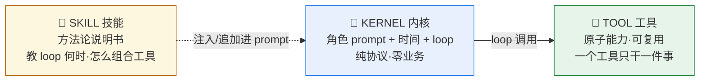
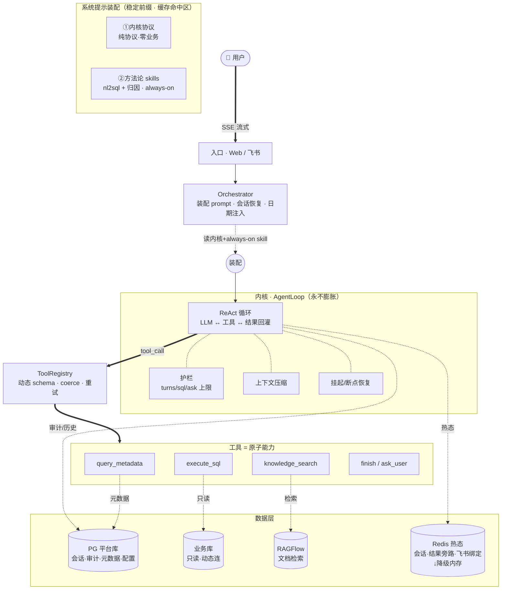
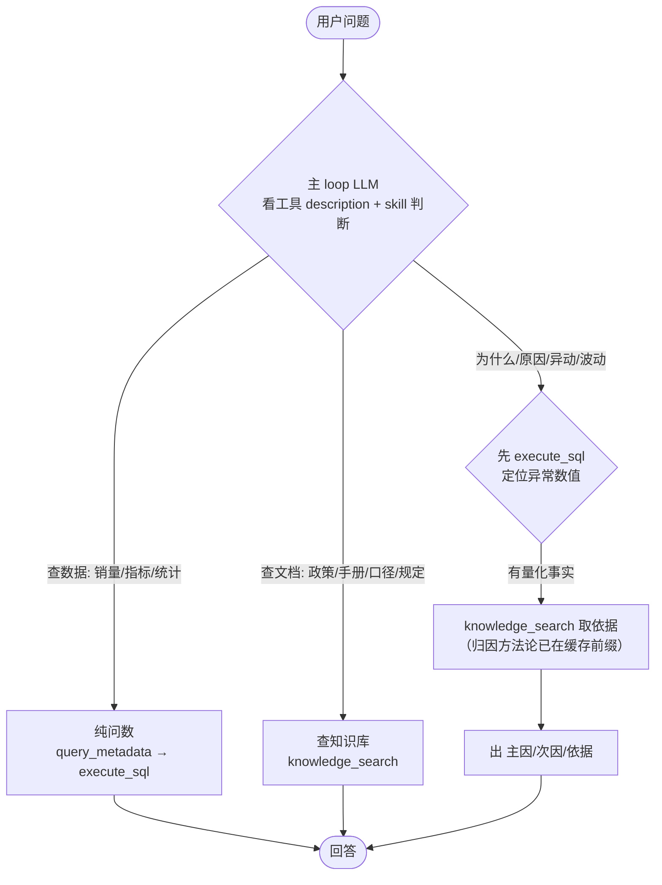
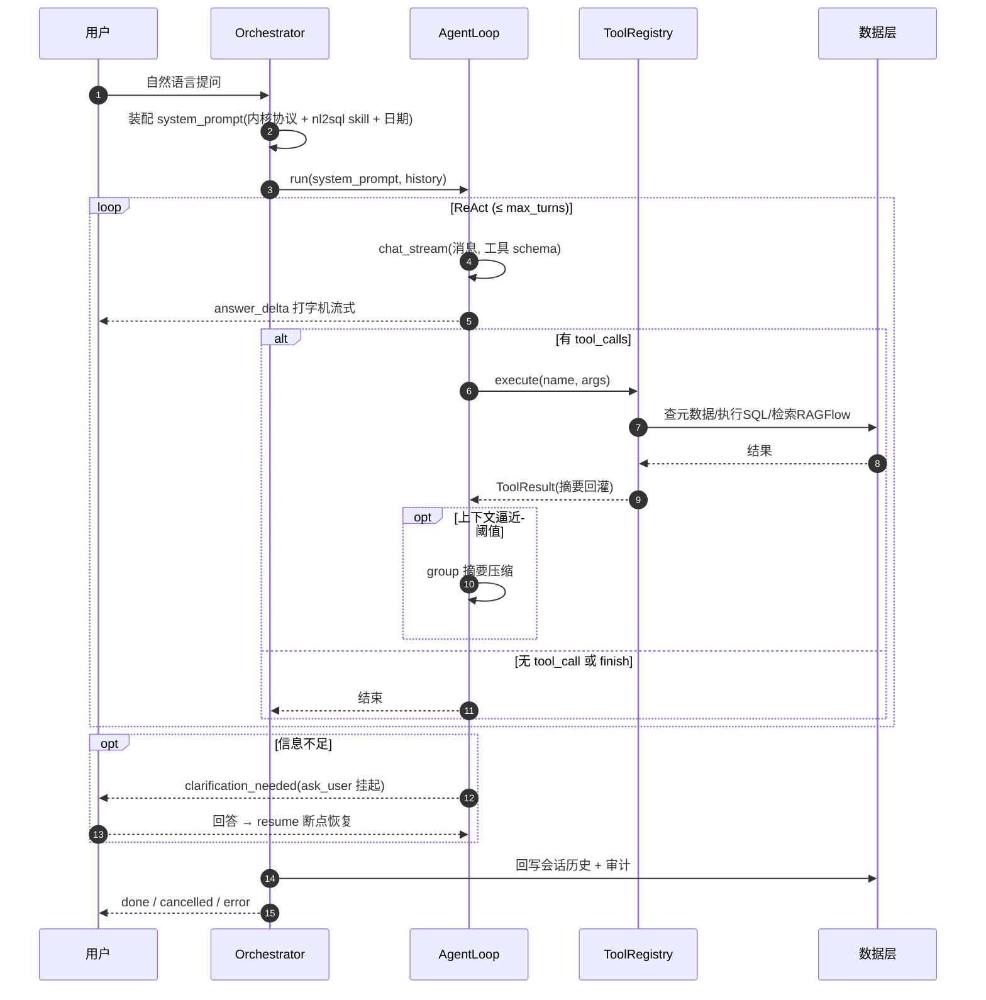

# NL2SQL 技术架构文档

> 内网单租户问数工具。本文是「系统是什么 + 为什么这么设计」的可迭代单一事实源。
> 「怎么一步步落地」见 `PLAN.md`。代码注释里历史遗留的 `spec 6.x` 引用以本文取代。

---

## 文档定位

本文服务于三个核心需求，并据此确立整体架构：

1. **接入企业知识库 RAGFlow** —— 文档/手册/政策/口径的检索统一走外部 RAGFlow。
2. **优化归因分析的胖逻辑** —— 删掉自包方法论又重复调知识库的胖工具，归因变成 skill。
3. **精准识别用户意图** —— 区分「纯问数 / 问数+归因 / 查知识库」，且不引入独立分类器。

后续每一节都可独立迭代；改完一节回头确认它仍和这三条需求一致。

---

## 一、三大需求 → 架构如何回应

### 需求 1：接入 RAGFlow（一个原子工具 + 热配置）

- 检索**只有一个工具** `knowledge_search`，转发 RAGFlow `/retrieval` API。
- RAGFlow 负责文档解析/分段/embedding/混合检索；本系统只取片段、由 LLM 整合回答。
- 配置（base_url / api_key / dataset_ids / 检索参数 / enabled）存 `ragflow_config` 表，admin 改完即生效（现读热更新）。
- **原则**：本系统不再做本地向量库，不碰 embedding——那是 RAGFlow 的事。

### 需求 2：优化归因胖逻辑（删胖工具 → 方法论 skill 化）

**问题**：现有 `do_attribution` 是个「胖工具」——它自己写归因 prompt、内部又调一遍知识库、再调专用模型。这和 `knowledge_search` 重复，违反「一个能力一个原子工具」。

**目标**：

| 拆出来 | 去向 |
|--------|------|
| 查知识库依据 | 复用现成的 `knowledge_search`（不重写） |
| 定位异常指标 | 复用现成的 `execute_sql` |
| 归因方法论（怎么推主因/次因/依据） | 抽成 **skill**（scene=`attribution`），always-on 注入缓存前缀 |
| 调专用归因模型 | 主 loop 自己推（它本就有推理能力）；不再单开模型调用 |

> **删掉 `do_attribution` 工具。** 归因 = 一段方法论 skill + 复用已有工具。
> 新增一个领域能力，只加一段方法论，不碰工具代码、不重复接口——这是「窄内核 + skill」的全部意义。

### 需求 3：精准意图识别（不分类器，靠工具描述 + skill 路由）

**关键决策：不预分类。** 不在 loop 前面塞一个意图分类器。原因：
- 分类器会引入额外往返、额外误差、和 loop 内决策重复。
- 单个 ReAct loop 天然能混合多种意图——LLM 看工具描述自己选。

**意图是「涌现」的**，由两样东西驱动：

1. **工具 description 的区分度**（最大的精度杠杆）：
   - `execute_sql`：「查**业务数据**（销售额/指标/统计）」
   - `knowledge_search`：「查**文档**（手册/政策/口径/规定/操作指南）」
2. **常驻方法论 skill**：归因方法论（attribution）always-on 在前缀，loop 拿到问数结果后直接按方法论推。

| 用户意图 | 典型问法 | loop 行为 |
|---------|---------|----------|
| **纯问数** | 「X月销量多少」「各省对比」 | nl2sql skill(always-on) → query_metadata → execute_sql → 回答 |
| **问数 + 归因** | 「X为什么降了」「异动原因」 | 先 execute_sql 定位数值 → knowledge_search 取依据 → 按常驻归因方法论出主因/次因 |
| **查知识库** | 「政策怎么规定」「操作手册」「这个指标口径」 | knowledge_search 取片段 → 基于片段回答 |

> 精度从哪来：**把工具 description 写到强区分**（适用 + 禁用场景都写），比堆一个分类器更有效、更易迭代。

---

## 二、三层抽象（核心心智模型）



| 层 | 是什么 | 代码 | 执行? |
|----|-------|------|------|
| **内核 KERNEL** | 角色 prompt（纯协议）+ 当前时间 + ReAct 循环。不含任何业务方法论 | `core/agent_loop.py` + 内核系统提示 | loop 自身跑 |
| **工具 TOOL** | 原子、可复用的执行能力：JSON schema（教参数）+ handler（真跑代码）。一个工具一件事 | `tools/*.py` + `registry.py` | handler 代码 |
| **技能 SKILL** | 纯文本方法论：教 LLM 在某领域何时、如何组合工具。不执行任何东西 | `prompt_store` 一个 scene | 只进 prompt |

**两条铁律**：
1. 新能力 = 先造 tool handler，再造 skill 教用；纯 skill 长不出执行能力。
2. **能力不重造**：一个能力只由一个工具承载——要检索就调 `knowledge_search`，**绝不在别的工具里重写一遍**（`do_attribution` 自己内部又调知识库，就是反面教材）。方法论走 skill。

---

## 三、架构总览



**说明**：
- 工具层全是**原子工具**（已无 do_attribution）；方法论（nl2sql/归因）走 skill，不占工具位。
- 两个 skill 都 **always-on**：orchestrator 启动时把所有 enabled skill 的 content 注入缓存前缀，**不建 load_skill**（2 个小 skill 全常驻代价可忽略，on-demand 是规模产物，YAGNI）。
- Redis 是**热态层**（会话状态、查询结果旁路、飞书会话绑定），连接失败降级进程内 dict。

---

## 四、意图识别机制（详解需求 3）

不预分类，靠「工具描述区分度 + 常驻方法论 skill」在单 loop 内涌现识别：



**精度三杠杆**（按优先级）：
1. **工具 description 写到强区分**：每个工具写清「适用 + 禁用」场景。这是最易迭代、最有效的。
2. **nl2sql skill（always-on）**：教会 loop 问数的标准链路（先元数据后 SQL）。
3. **归因 skill（always-on）**：归因方法论已在缓存前缀，loop 拿到问数结果后直接按方法论推（execute_sql 定位 → knowledge_search 取依据 → 主因/次因）。hybrid（又问数又归因）单 loop 天然完成，不用切 prompt、不用起子任务、不用 load。

---

## 五、skill 体系与装配

### 5.0 skill 标准化契约（一个 skill = 一份 manifest + 一段方法论）

借鉴 **Agent Skills 规范（agentskills.io）** 与 **Hermes `SKILL.md`**：skill 是「带标准前置元数据的可热更方法论文档」，不是散装 prompt。每个 skill 一条记录：

| 字段 | 作用 | 运行时用? |
|------|------|-----------|
| `name`（原 `scene`） | 唯一标识（nl2sql / attribution） | 是 |
| `description` | 一句话作用 + 何时用 | 仅 admin 展示（content 常驻，无需廉价索引） |
| `mode` | `always_on` / `on_demand` | 当前恒 `always_on`；`on_demand`+load_skill 为未来预留，**现在不建** |
| `content` | 方法论正文 | **always_on：注入缓存前缀** |
| `version` / `enabled` | 版本/开关（沿用 prompt_store） | 是 |

> 对应 DB：现有 `prompt` 表加 `description`、`mode` 两列即可（`scene` 即 `name`）——**零新增表**。

### 5.1 两个 skill（都是 always-on）

| skill | 内容 |
|-------|------|
| **nl2sql 问数** | query_metadata → 选表 → execute_sql → 回答原则；SQL 原则（只读/全限定名/JOIN 优先…） |
| **归因 attribution** | execute_sql 定位事实 → knowledge_search 取依据 → 主因/次因/依据分层；无依据如实说明 |

两者都是「某领域方法论」，**都 always-on**。内核不认识任何领域；新增领域只加一条 skill 记录，不碰工具代码。

### 5.2 装配顺序与缓存边界

```
[①内核协议] → [②所有 enabled skill 的 content（固定顺序：nl2sql → 归因）] → ◆缓存断点◆ → [③对话 + 工具结果]
 基本不动      always-on 常驻，顺序定死勿乱调                              ↑              只增不改
              断点之前不变 = 缓存命中
```

> 断点之前（①②）不变 = 提示缓存命中；③是会话动态部分。
> **没有 skill 索引层、没有 load_skill**：content 直接常驻前缀，省掉索引与按需加载的整套机制。

### 5.3 为什么不建 load_skill（纠正：别误借 Hermes）

Hermes 有 on-demand `load_skill`，是因为它 **95 个 skill**，全常驻会爆 prompt。我们 **2 个小方法论 skill**（几百 token），全常驻代价可忽略；而 load_skill 要多一个工具、多一次往返、还得赌 LLM 该调时记得调（漏调 → 归因降级）。**小规模上 on-demand 是净亏。**

→ 现状：两个 skill 都 always-on。等哪天真堆到 **5+ 个大 skill**，再上 `mode=on_demand` + load_skill + skill 索引（YAGNI）。`mode`/`description` 字段现在留在 schema 里只作前瞻，运行时不读。

### 5.4 借鉴 Hermes / Agent Skills（取与不取）

| 借鉴（保留） | 不借鉴（规模不同，别照搬） |
|------|------|
| ✅ SKILL.md 式 manifest（name/desc/content/version/enabled） | ❌ on-demand **load_skill 工具**——规模驱动特性，Hermes 95 skill 才需要，我们 2 个不需要 |
| ✅ skill 概念（方法论与工具解耦、可热更、按 scene 挂载） | ❌ 廉价 skill 索引常驻层（content 常驻就不需要） |
| ✅ 渐进式披露（写 skill 内容时常见流程放前，省 token） | ❌ 文件系统 skill 目录 / 技能市场 / 安全扫描（内网单租户） |
| ✅ 缓存前缀 / 临时层严格分离 | — |

依据：Hermes 的「技能 vs 工具」判定 = 我们「一个能力一个原子工具、方法论走 skill」——能用「指令+现有工具」表达 → skill；要 API 密钥/认证/精确执行/二进制流 → 工具。

---

## 六、请求处理流程



末事件必为 `done` / `clarification_needed` / `cancelled` / `error` 之一。

---

## 七、分层详解

### 7.1 入口层
- **Web SSE**（`web/routes/ask.py`）：`POST /api/ask`，全程 SSE 流式透传。
- **飞书**（`feishu/adapter.py`）：IM 机器人，复用同一 Orchestrator。
- 两者共用下游，区别只在适配（飞书卡片 / SSE 事件）。

### 7.2 编排层
- **Orchestrator**（`core/orchestrator.py`）：装配 system_prompt（内核协议 + always-on skill + 日期注入）、判断会话恢复、迭代 loop 透传事件。**不含业务逻辑**。

### 7.3 内核层
- **AgentLoop**（`core/agent_loop.py`）：ReAct 循环。流式收 content + tool_calls 增量 → 逐工具 execute → 摘要回灌 → 重复，直到 finish / 无 tool_call / 护栏 / 取消。
- **护栏**（`_limits`）：max_turns / max_sql / max_sql_fail_streak / max_meta_per_run / max_ask_user；`reload_limits` 热更新。
- **上下文压缩**（`_maybe_compress`）：绝对 token 阈值触发，按 group 摘要，query_metadata 结果不压。
- **SessionState**（`core/session.py`）：ask_user 挂起存 checkpoint，回答后 resume。

### 7.4 工具层（全原子，无胖工具）
| 工具 | 作用 | 连哪 | 状态 |
|------|------|------|------|
| `query_metadata` | 取表/字段/关联/注释 | 平台库元数据 | ✅ |
| `execute_sql` | 只读查业务数据（sqlglot 校验禁 DDL/DML） | 业务库动态连 | ✅ |
| `get_sql_template` | 取现成 SQL 样板（同比/环比/行转列等）供改写套用 | 平台库 sql_templates 表 | ✅ |
| `knowledge_search` | 检索文档片段 | RAGFlow | ✅ 待修 bug |
| `finish` / `ask_user` | 结束 / 澄清 | 置标志位 | ✅ |
| ~~`do_attribution`~~ | ~~归因胖工具~~ | — | **删** |

注册表 `registry.py`：动态 schema 重建（防幻觉调隐藏工具）+ coerce 强转 + 可用性过滤 + 可恢复错误退避重试。

### 7.5 数据层（双库分离 + 热态 + 外部检索）
| 层 | 存什么 | 连法 |
|----|--------|------|
| **平台库 PG** | 会话/消息/审计/元数据/配置表/prompt | ORM，全局 AsyncSession |
| **业务库** | 用户要查的业务数据 | execute_sql 按 datasource_id 动态只读连，查完即弃，**不经 ORM** |
| **RAGFlow** | 文档/向量（解析分段全归它） | knowledge_search 转发 retrieval API |
| **Redis** | 会话热态 / 查询结果旁路(TTL) / 飞书会话绑定 | 连接失败降级进程内 dict |

> 混淆平台库/业务库是最常见的错。元数据/审计/配置写平台库；问数结果从业务库捞。

---

## 八、设计原则

1. **极简内核 + 处理真见过的失败**：内核只做协议；稳健只建四样——完整 schema + 写到位 description、错误回传不静默吞、loop 上限、仅危险操作确认。
2. **能力 = tool × skill**：tool 决定能不能，skill 决定何时。能力不重造（一个能力只挂一个工具，复用而非重写），方法论走 skill。
3. **热更新优先于重启**：可变配置进数据库表，不进 yml。
4. **优雅失败 > 重型防御**：超时/报错让 LLM 干净汇报，不建 circuit breaker。
5. **意图涌现，不分类器**：靠工具描述 + skill 路由，单 loop 内自然分流。

---

## 九、不做（防过度工程边界）

| 不做 | 理由 |
|------|------|
| 独立意图分类器 | 引入往返+误差，和 loop 内决策重复；工具描述区分度更有效 |
| 胖工具（自包方法论+重复调知识库） | `do_attribution` 反面教材；拆成 skill + 原子工具 |
| 强制任务拆解（每查询过 planner） | 简单查询过 planner 纯加延迟 |
| 二次确认覆盖所有操作 | 只对不可逆操作；纯 SELECT 不确认 |
| circuit breaker / 静默重试 | 提前替没出现的问题写代码；错误回传 loop 即重试 |

---

## 十、现状 → 目标 差距速查

| 模块 | 现状 | 目标 | 阶段 |
|------|------|------|------|
| `knowledge_search` | 已走 RAGFlow ✓ | 修 client bug + 连接池 | P1 |
| `do_attribution` | 胖工具(重复调知识库) | **删** → 归因 skill | P0 删 / P2 重建 |
| 内核 system prompt | nl2sql 方法论硬编码兜底 | 拆：内核纯协议 + nl2sql always-on skill | P2 |
| RAGFlow 后台配置 | 旧 admin_knowledge 挂死 store | admin_ragflow 新路由 + 前端 tab | P3 |
| 死引用(EMBEDDING_DIM 等) | 服务起不来 | 清理 | P0 |
| CLAUDE.md / README | 描述已删功能 | 同步 | 收尾 |
