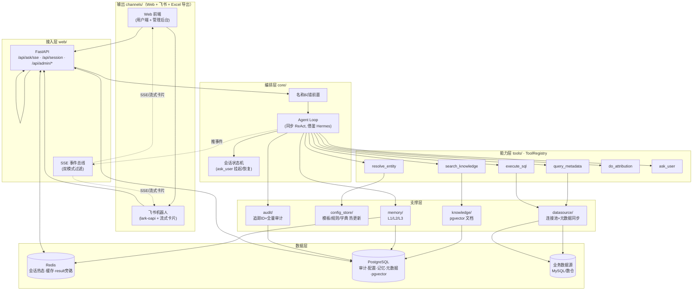
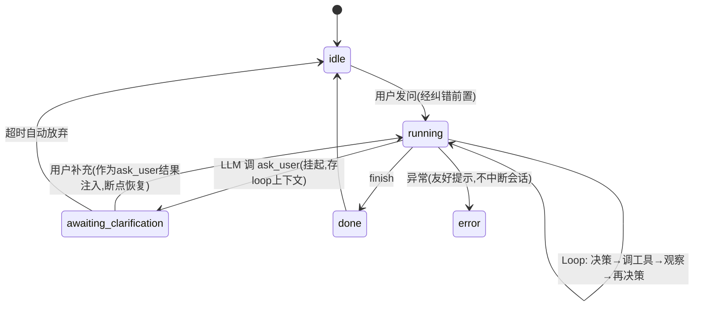

# AI问数工具 技术架构与功能方案设计

| 项 | 值 |
|---|---|
| 文档日期 | 2026-07-17 |
| 版本 | v0.1（初稿，待评审） |
| 状态 | 设计中 |
| 落地目录 | `/Users/liuxiangwu/PycharmProjects/nl2sql/`（从零新建） |
| 关联需求 | 《AI问数工具 完整业务需求文档》（十一章） |
| 参考实现 | nl2sql 2（前序 MVP，仅作反面教材与局部借鉴）、agent_platform（前序骨架，已废弃） |

---

## 1. 背景与目标

### 1.1 业务背景

构建一个面向内部业务用户的自然语言问数（NL2SQL）Agent 平台：用户用自然语言提问，系统自动查结构化数据库、必要时联动知识库做归因分析，结果按渠道（Web / 飞书）输出。核心需求覆盖十一章：基础交互、数据查询、SQL 模板、业务规则、归因分析、知识库、SSE 流式、多渠道输出、名称纠错、审计追溯、可视化配置。

### 1.2 现状与从零规划的理由

团队已有两个前序项目，均不作为本次落地基础：

- **`nl2sql 2/`**：可跑的问数 MVP，但存在架构级缺陷，用户明确反馈"反问用户根本用不了""错别字识别根本不行""已解决就是拆东墙补西墙"：
  - **线性管线，无 Agent Loop**：固定四阶段（澄清预检→规划→执行→总结），LLM 不能自主调工具、不能多步迭代。
  - **反问（缺参澄清）失效根因**：澄清只在开头跑一次，没有会话状态机，用户补充条件后从头重跑而非断点恢复。
  - **名称纠错失效根因**：没有独立纠错层，靠运行时 SQL `LIKE '%新疆省分公司%'` 查库，错名查不到直接失败；无静态字典、无编辑距离/拼音匹配。
  - 自研连接池、SQLite 单机、无向量库、无审计。
- **`agent_platform/`**：曾有的 MCP/三层记忆骨架，README 严重过时，实际可用性存疑，不沿用。

**决策：在空目录从零新建**，吸取 `nl2sql 2` 在元数据管理、实体解析、SQL 安全校验上的成熟做法，但编排核心重写。

### 1.3 设计目标

1. 真正的 Agent：LLM 自主 ReAct 循环，可中途 `ask_user`、多步迭代、错误自愈。
2. 反问与纠错作为一等公民可用、可测。
3. 配置（模板/规则/纠错字典）可视化、热更新、不重启。
4. 渠道无关：一套标准 JSON，多渠道适配，飞书用官方流式卡片。
5. 全链路可审计、可追溯。

---

## 2. 关键设计决策（ADR）

| # | 决策 | 结论 | 理由 |
|---|---|---|---|
| ADR-1 | 语言 | **Python 3.12** | 参考框架 Hermes 为 Python；飞书 `lark-oapi` Python SDK 成熟；AI 生态一等公民；沿用 Qwen 流式兼容经验 |
| ADR-2 | 架构取向 | **自研轻量 ReAct 循环**（借鉴 Hermes 同步循环） | 瓶颈是 LLM 延迟非 I/O 并发，同步循环易推理调试；LangGraph 对 Qwen 流式工具调用有坑；Hermes(35.7k★) 同样不用重量级框架 |
| ADR-3 | 存储 | **Redis（热态）+ PostgreSQL（持久）+ pgvector（向量）** | 会话热态/缓存走 Redis；审计/配置/记忆走 PG；知识库复用 PG 的 pgvector，不另起向量库 |
| ADR-4 | 飞书 | **lark-oapi 官方 SDK + 官方流式更新卡片 API** | 飞书有原生流式卡片能力（cardkit-v1 streaming-updates），专为 AI 对话设计；不自己撸 webhook/周期刷新 |
| ADR-5 | 框架边界 | 基础设施全用官方库，Agent 内核参考 Hermes 自研 | 连接池用 SQLAlchemy、向量用 pgvector、文档解析用 unstructured；Agent 循环 + ToolRegistry 参考 Hermes 模式自研（无完美现成框架） |
| ADR-6 | 前端 | Vue3 + Vite + Element Plus | 前后端分离，管理后台配置项多需组件库 |

---

## 3. 参考与借鉴

### 3.1 Hermes Agent（主体借鉴）
[源码剖析](https://www.feishu.cn/content/article/7628541877674953666)。定位"轻量后端 + 重 Agent 循环"，与我们业务系统契合。直接采纳：
- `run_conversation()` 完全同步循环 + `ThreadPoolExecutor` 显式并行。
- ToolRegistry：自注册 + 运行时可用性检查（缺依赖工具自动隐藏，优雅降级）+ 动态 Schema 重建（防模型幻觉工具调用）。
- `coerce_tool_args` 参数类型强转。
- 有界记忆（MEMORY/USER 分离，字符上限）+ 快照注入保前缀缓存。
- `delegate_task` 子 Agent：全新上下文 + 受限工具集 + 深度上限 2 + 并行上限 3（归因子分析时启用）。
- Gateway：单进程管理所有平台适配器生命周期。

**YAGNI 不引入**：Cron 自然语言定时、Docker/SSH/Modal 多终端后端、ACP 编辑器集成（需求无）。

### 3.2 OpenClaw（局部借鉴）
定位"重 Gateway 平台 + 分布式 Node"。仅借鉴：
- 分级沙箱（off / non-main / all）思想 → SQL 执行环境隔离。

### 3.3 飞书官方能力
- [流式更新卡片 API](https://open.feishu.cn/document/cardkit-v1/streaming-updates-openapi-overview?lang=zh-CN)：原生流式渲染。
- [lark-oapi 卡片交互 Quick Start](https://open.feishu.cn/document/uAjLw4CM/ukzMukzMukzM/feishu-cards/quick-start/develop-a-card-interactive-bot?lang=zh-CN)。
- [飞书 AI 机器人流式输出实践](https://juejin.cn/post/7600990891206819867)。

---

## 4. 总体架构

### 4.1 分层架构



### 4.2 三条贯穿主线
1. **SSE 主线**（需求 7）：编排层每一步 → 事件 → SSE 总线（双模式过滤）→ 渠道层（Web 原生 SSE / 飞书流式卡片）。
2. **配置主线**（需求 3/4/9）：PG 动态配置表 → `config_store` 内存缓存（带版本号）→ 编排/能力层实时读取，修改即生效。
3. **审计主线**（需求 10）：追踪 ID 串联输入→纠错→工具调用→SQL→结果→知识→归因→输出全量，落 PG。

---

## 5. 模块划分与职责边界

### 5.1 目录结构

```
nl2sql/
├── config/                      # 静态基线配置
│   ├── application.yml          # 基线（LLM/Redis/PG/profile）
│   ├── application-dev.yml      # profile 覆盖
│   └── datasources/*.yml        # 数据源连接（也可后台改）
├── src/
│   ├── main.py                  # FastAPI 入口 + lifespan 初始化链
│   ├── config.py                # 配置加载（YAML + PG 动态合并）
│   ├── core/                    # 编排核心
│   │   ├── orchestrator.py      # 入口：纠错前置 → Agent Loop → 会话状态
│   │   ├── agent_loop.py        # 同步 ReAct 循环（借鉴 Hermes）
│   │   ├── normalizer.py        # 名称纠错前置
│   │   ├── session.py           # 会话状态机 + ask_user 挂起恢复
│   │   └── context.py           # 上下文组装（L1+L2+L3）与压缩
│   ├── tools/                   # 能力层
│   │   ├── registry.py          # ToolRegistry（动态Schema/类型强转/可用性检查）
│   │   ├── metadata.py          # query_metadata
│   │   ├── sql_engine.py        # execute_sql（生成/校验/执行/结果旁路）
│   │   ├── knowledge.py         # search_knowledge
│   │   ├── entity.py            # resolve_entity
│   │   ├── attribution.py       # do_attribution
│   │   └── ask_user.py          # ask_user（触发挂起）
│   ├── llm/                     # LLM 服务（沿用 collect_stream_result 双键兼容）
│   ├── memory/                  # L1 work / L2 摘要 / L3 全局
│   ├── datasource/              # 连接池(SQLAlchemy) + 元数据定时同步
│   ├── config_store/            # PG 动态配置 + 内存缓存 + 热更新广播
│   ├── knowledge/               # 文档上传/分段/embedding/检索
│   ├── channels/                # 输出（无抽象层，各自直接实现）
│   │   ├── web.py               # Web SSE 输出
│   │   ├── feishu/              # lark-oapi + 流式卡片 + 配对码
│   │   └── export.py            # Excel 导出
│   ├── audit/                   # 追踪 ID + 全量审计
│   ├── web/
│   │   ├── routes/ask.py · session.py · admin/*.py
│   │   └── sse.py               # 事件类型 + 双模式过滤
│   └── logging.py
├── frontend/                    # Vue3 前端
├── tests/
└── docs/
```

### 5.2 关键接口契约

**工具统一接口**（ToolRegistry 注册）：
```python
@dataclass
class ToolDefinition:
    name: str                       # 如 "execute_sql"
    description: str                # 给 LLM 的说明
    parameters: dict                # JSON Schema
    handler: Callable               # async (args, ctx) -> ToolResult
    availability: Callable[[], bool]# 运行时可用性检查（缺依赖则隐藏）
```

**编排层入口**（所有渠道共用同一内核）：
```python
async def handle_message(
    user_id: str, session_id: str, text: str,
    channel: Channel, trace_id: str
) -> AsyncIterator[SSEEvent]:
    """渠道层调它，拿到事件流自己渲染（Web 收 SSE / 飞书刷卡片）"""
```

**输出**：Web（SSE 事件流）、飞书（lark-oapi 流式卡片）、Excel 导出，三者各自直接从执行结果渲染，**不设统一 Channel 抽象**。

### 5.3 单元边界原则
- `tools/` 每个工具单一职责，编排层只认 `ToolDefinition` 接口，新增工具零侵入。
- `channels/` 三个输出（Web/飞书/导出）只做格式转换，永不改业务数据。
- `config_store/` 是所有热更新配置的唯一入口，带版本号 + 失效广播。

---

## 6. Agent 编排核心（对应需求 1、7、9）

### 6.1 自主 ReAct 循环（借鉴 Hermes 同步循环）

```python
# core/agent_loop.py 伪代码
def run_conversation(ctx, user_msg, cancel_token):
    messages = ctx.assemble()          # L1 work + L2 摘要 + L3 全局
    messages.append({"role": "user", "content": user_msg})
    for turn in range(ctx.max_turns):  # 护栏：上限默认 10
        resp = llm.chat(messages, tools=registry.available_defs())
        messages.append(resp)
        emit(turn, resp)               # 双模式过滤后推送
        if not resp.tool_calls:
            break                       # LLM 给最终答案
        # 同步逐一执行；独立工具用 ThreadPoolExecutor 并行
        results = execute_tool_calls(resp.tool_calls, ctx, cancel_token)
        for call, result in zip(resp.tool_calls, results):
            messages.append(tool_msg(call.id, result.summary))  # 只回灌摘要
        if cancel_token.cancelled: break
        maybe_compress(ctx, messages)  # loop 内上下文压缩
    ctx.persist(messages)
    return final_answer(messages)
```

**护栏（写死）**：`max_turns`、超时、token/成本上限、重复调用检测（同工具同参连调 2 次强制收敛）、单轮 `ask_user` 次数上限（默认 2，超限给当前最优答案 + 提示）。

### 6.2 工具清单与 ToolRegistry

| 工具 | 作用 | 备注 |
|---|---|---|
| `query_metadata` | 查表/字段/注释/关系 | 选表用 |
| `execute_sql` | 生成+校验+执行 SQL | 全量结果旁路，只回灌摘要 |
| `search_knowledge` | 知识库语义检索 | pgvector |
| `resolve_entity` | 实体名→标准名+记录ID | 纠错后查实际记录 |
| `do_attribution` | 归因子分析 | loop 内调多源工具 |
| `ask_user` | 向用户提问 | 调用即触发挂起 |
| `finish` | 给最终答案 | 结束 loop |

**ToolRegistry 借鉴 Hermes 的三点**：
1. **运行时可用性检查**：数据源未配则 `query_metadata` 自动隐藏，不报错。
2. **动态 Schema 重建**：可用工具变化时重建 `execute_sql` 描述，防 Qwen 幻觉调用不存在的表/工具。
3. **`coerce_tool_args`**：LLM 返回字符串参数按 JSON Schema 自动强转（`"100"`→`100`），减少工具调用失败。

### 6.3 名称纠错前置（治 nl2sql 2 错别字失效）

在 `user_msg` 进 loop **之前**先过 `normalizer`，与查询彻底解耦：

```
输入文本
  ├─ 1. 静态字典（精确，零幻觉）：name_dict 命中 → 直接替换
  ├─ 2. 模糊兜底：编辑距离(Levenshtein) + 拼音索引(谐音) → 过置信阈值才替换
  └─ 3. LLM 语义兜底：口语化表述（"那个风大的场站"）→ 给字典候选+上下文让 LLM 选
输出：标准化文本 + 修正记录[{原值, 标准值, 置信度, 来源}]
```

- 查询层永远只用纠错后的标准名。
- 修正记录按需求 9.4 开关决定是否告知用户（"已将『新疆省分公司』纠正为『新疆分公司』"）。
- 字典分三类：错别字、谐音/简称、错误行政区划。

### 6.4 会话状态机与 ask_user 跨消息持久化（治 nl2sql 2 反问失效）

状态：`idle / running / awaiting_clarification / done / error`，存 Redis。



**关键机制**：`ask_user` 是 loop 内的一个工具。调用时：保存 loop 上下文（messages + 已执行工具）到 Redis → 发 `clarification_needed` 事件 → 本轮 SSE 结束。用户下一条进来，`orchestrator` 检查会话状态：
- 若 `awaiting_clarification` → 把用户回答**作为 `ask_user` 的工具结果** append 进 messages → 从 Redis 恢复 loop 上下文 → 继续循环（**不重新走意图识别/纠错/规划**）。
- 缺多个参数时可多次挂起。

**这是 nl2sql 2 完全缺失的能力**——它没有状态机，补了条件接不上。

### 6.5 结果旁路 result_id（NL2SQL 特有，借鉴 Claude Code 模式）

`execute_sql` 执行后：全量结果存 Redis（TTL）+ PG（审计），分配 `result_id`。返回给 LLM 的工具结果 = **摘要**（行数、列名、前 5 行、关键聚合）。LLM 基于摘要决策；最终答案用 `result_id` 引用全量数据，渠道层自行渲染表格。

**为什么必须**：1000 行结果全回灌 LLM 会爆 token、慢、贵、模型失焦。同时满足需求 2.3.4（明细分页）与需求 10（审计存全量）。

### 6.6 取消令牌与 loop 护栏
`cancel_token` 贯穿 loop 每一圈与每个工具执行检查点；前端/飞书"停止"→置位→loop 在下一检查点退出，释放数据库连接。满足需求 7.5。

### 6.7 上下文压缩
loop 跑多圈（归因可达 8-10 圈）易超 Qwen 窗口。`maybe_compress` 在阈值（默认 80%）触发：把早期工具结果压成摘要（结果本就旁路，压缩更轻）。会话级另有 L2 增量摘要。

### 6.8 双模式 SSE 事件清单（需求 7.2、7.3）

| 事件类型 | 管理员模式 | 用户模式 |
|---|---|---|
| `correction` 名称纠错结果 | ✅ | ✅（按开关） |
| `clarification_needed` 缺参提示 | ✅ | ✅ |
| `plan` / `todo_update` 执行计划 | ✅ | ✅（进度） |
| `metadata_lookup` 元数据检索 | ✅ | ❌ |
| `sql_generated` 实时 SQL | ✅ | ❌ |
| `query_progress` 查询进度 | ✅ | ✅ |
| `knowledge_hit` 知识库检索片段 | ✅ | ❌ |
| `attribution_step` 归因每步思考 | ✅ | ❌ |
| `intermediate` 中间结论 | ✅ | △（精简） |
| `answer_delta` 流式答案 | ✅ | ✅ |
| `done` / `error` | ✅ | ✅ |

过滤在 `web/sse.py` 统一做。流程结束推送完整标准化结果包后关闭连接。

---

## 7. 数据查询能力（对应需求 2）

### 7.1 数据源管理
- 后台可视化配置连接（host/port/db/user/pwd/type），存 PG `datasources` 表，**无硬编码**（需求 2.1.1）。
- 连接池用 **SQLAlchemy**（替换 nl2sql 2 自研 `SimpleConnectionPool`）。
- 支持 MySQL、PostgreSQL、数仓（Doris/StarRocks 兼容 MySQL 协议）。
- **优先业务视图**对接，屏蔽原始表、隐藏敏感/系统字段（需求 2.1.2）。

### 7.2 元数据同步与缓存（需求 2.1.3）
- `datasource/metadata_sync.py` 定时同步：表名、中文注释、字段名/注释/类型、主键、外键、索引、关系。
- 元数据存 PG `metadata_*` 表（元数据中心），内存缓存。
- 支持从数据库反向同步并保留手写中文描述（沿用 nl2sql 2 `sync.py` 的成熟做法），自动推断关系/规则/展示列。
- 触发：定时 + 手动 `POST /api/admin/metadata/sync`。

### 7.3 NL2SQL 生成链路
1. LLM 调 `query_metadata` 选表（只发表名+描述省 token，≤2 表直接全选）。
2. LLM 调 `execute_sql` 生成 SQL（只发选中表 schema）。
3. 工具内校验：表/字段是否在白名单 → 失败把错误回灌 LLM 自愈（见 6.1）。
4. 执行 → 结果旁路（6.5）。

### 7.4 多表关联（需求 2.2）
- **优先预配置关联**：`table_relations` 表存主表/关联表/关联字段/关联类型/业务说明，LLM 读它生成 JOIN。
- **无预配置兜底**：LLM 依表/字段注释推导关联（标注为"推断"，可后台确认转正）。

### 7.5 字段展示规则（需求 2.3）
- 每表配置 `display_columns`：核心字段默认展示、维度字段仅筛选不展示、技术字段（ID/创建时间）全程隐藏。
- 自动分层 + 手动覆盖；用户指定额外指标时在默认基础上追加。
- 明细默认分页（如 100 行），提示缩小筛选范围。

### 7.6 SQL 安全管控（需求 2.1.4）
`execute_sql` 工具内**硬护栏**（LLM 绕不过）：
- 仅放行 `SELECT` / `WITH`；拦截 DML/DDL。
- 查询超时（默认 30s）、最大扫描行数（可配）。
- 参数化防注入；危险函数黑名单。

### 7.7 数据权限过滤（需求 2.1.5 — ⚠️ 本期暂缓）
本期**不做数据权限隔离**，user_id 仅用于会话/记忆/审计隔离，所有用户查相同数据。未来需要时再加 `user_id → 可见范围` 映射 + `execute_sql` 拼接过滤条件。

---

## 8. 配置体系（对应需求 3、4、9、11）

### 8.1 三层配置模型
| 层 | 内容 | 存储 | 更新方式 |
|---|---|---|---|
| 静态 | 数据源连接、LLM、基础设施 | YAML | 改文件重启 |
| 动态 | SQL 模板、业务规则、纠错字典、字段规则、展示规则 | PG | **后台改即生效** |
| 元数据 | 表/字段/关系/注释 | PG | 定时同步 |

### 8.2 SQL 模板（需求 3）
- 后台可视化配置：多表 JOIN、子查询、多层聚合、CASE、同比环比等复杂逻辑。
- **参数化占位**：时间区间/机构/场站/指标阈值，支持默认值 + 校验规则。
- **绑定触发语义/关键词**：用户提问命中场景 → 优先调模板（而非 LLM 临时生成）。
- 缺参自动触发 `ask_user`。
- 启用/禁用、版本管理、改配置实时生效。
- 绑定格式化规则：小数位、单位拼接、空值替换、固定展示字段。

### 8.3 业务规则（需求 4）
- 指标规则：计算口径、同比环比逻辑、异常阈值、别名/同义映射。
- 查询约束：全局最大查询跨度、单次维度上限、高频缓存策略、敏感指标权限。
- 交互规则：缺参询问优先级、纠错映射维护、错别字开关。
- 归因规则：各指标异常固定分析维度、维度对应 SQL/知识检索关键词、主次因判定标准。

### 8.4 名称纠错字典（需求 9）
- `name_dict` 表：错误名/谐音/简称/错误行政区划 → 标准名，分三类。
- CRUD 后台 + 开关（是否告知用户已修正）。

### 8.5 热更新机制
`config_store`：PG 表带 `version`，内存缓存订阅变更广播（Redis pub/sub），后台保存即 bump version → 各进程缓存失效重载，**新会话直接用最新配置，不重启**（需求 11.1、11.2）。

---

## 9. 归因分析与知识库（对应需求 5、6）

### 9.1 归因触发（需求 5.1）
意图识别区分：对比/异动/原因类提问 → 触发归因；普通取数不触发。意图判断由 LLM 在 loop 内完成（命中归因则调 `do_attribution`）。

### 9.2 双源归因（需求 5.2）
`do_attribution` 工具内：
1. **结构化数据**：按预设维度（检修工单/限电/气象/故障台账）查量化数据。
2. **知识库**：语义检索历史复盘/运维手册/调度政策/指标口径。
3. 整合量化+文档，按主次因判定标准分层输出（主因/次因/参考依据）。
4. **无数据/文档支撑时如实告知，不编造**（需求 5.4）。

归因在单 Agent loop 内完成：`do_attribution` 工具内部并行调用多源查询（工单/限电/气象/知识库），不引入子 Agent。

### 9.3 知识库（需求 6）
- pgvector，文档分段 + embedding（**走 LLM 模型网关 embedding 接口**，不本地部署）。
- 文档分类管理 + 权限绑定，用户仅检索权限范围内文档。
- 归因/指标答疑场景自动检索匹配片段作为依据。
- 文档更新/启用/禁用，快速更新政策与案例。

### 9.4 文档管理
上传 TXT/MD（需求 6.1），`knowledge/` 负责：分段 → embedding → 入库 → 检索。后台 CRUD + 启停。

---

## 10. 输出（Web / 飞书 / Excel 导出）

**不做"多渠道抽象层"**（无标准中立 JSON 中间层、无 Channel 协议）。三个实际输出各自直接从 Agent 执行结果渲染。需求 8.4 的"预留多渠道扩展"与 8.5 的"各渠道独立配置"本期不做（YAGNI）。

### 10.1 执行结果数据结构
Agent 执行完产出统一结果 dict（Web/飞书/导出共用读取，但只是普通数据结构，非"渠道中立规范"）：
```json
{
  "trace_id": "...",
  "type": "query | attribution | chitchat | clarification | error",
  "title": "新疆分公司 2026-06 发电量",
  "summary": "上月发电量 X，同比下降 Y%",
  "table": {"columns": [...], "rows_ref": "result_id", "total": 1000},
  "attribution": {"main_cause": "...", "secondary": [...], "evidence": [...]},
  "corrections": [{"from":"新疆省分公司","to":"新疆分公司"}],
  "meta": {"cost_tokens": 12345, "elapsed_ms": 3200}
}
```

### 10.2 Web 输出
直接走 SSE 事件流（双模式过滤见 6.8），前端渲染。

### 10.3 飞书接入（需求 8.2、8.3）
- **入站**：lark-oapi 长连接事件订阅（`im.message.receive_v1`），验签 + 取文本。群内 **@bot 才响应**；**私信配对码**绑定飞书用户 ↔ 系统用户/权限（借鉴 Hermes）。
- **内核**：复用 `handle_message`，与 Web 同一编排内核。
- **出站流式**：先创建"分析中"卡片 → **官方流式更新卡片 API** 逐步推送进度 → 最终定稿为结果卡片（表格/分层结论/溯源 ID 底部）。
- **降级**：缺参/报错走纯文本消息，不发卡片（需求 8.3）。
- 鉴权：`app_id`/`app_secret`/`tenant_access_token`，卡片 `config.update_multi=true`。

### 10.4 Excel 导出（需求 8.4）
大结果/明细一键导出 Excel（openpyxl，沿用 nl2sql 2 `export_service` 思路），通过 `result_id` 取全量数据生成；`GET /api/export/{result_id}`。

### 10.5 双模式输出
管理员（卡片/SSE 含 SQL/检索细节折叠区）；普通用户仅结论+表格。

---

## 11. 审计与可追溯（对应需求 10）

### 11.1 追踪 ID
每条会话消息生成全局 `trace_id`，串联 SSE 日志、查询、分析全链路。注入到每个 SSE 事件、日志、标准 JSON、飞书卡片底部。

### 11.2 全量审计落库
`audit_traces` 表持久化全量记录（需求 10.2）：原始输入、纠错前后文本、补充条件、命中模板/生成 SQL、数据库结果（result_id）、知识库检索片段、归因结论、每步流式执行记录、耗时、Token 消耗。

### 11.3 回溯查询
按 trace_id / 用户 / 时间 / 会话回溯完整链路（需求 10.3），管理后台提供查询界面。

---

## 12. 核心数据模型（PostgreSQL）

关键表（DDL 级，字段精简）：

```sql
-- 会话与消息（热态在 Redis，持久在 PG）
sessions(id, user_id, channel, status, created_at, updated_at, ttl_at)
messages(id, session_id, role, content, trace_id, created_at)
loop_checkpoints(id, session_id, messages_json, pending_tool, created_at)  -- ask_user 挂起恢复

-- 审计
audit_traces(trace_id PK, session_id, user_id, raw_input, normalized_input,
             corrections_json, tool_calls_json, sql_text, result_id,
             knowledge_hits_json, attribution_json, sse_log_json,
             elapsed_ms, cost_tokens, created_at)

-- 结果旁路
query_results(result_id PK, session_id, columns_json, rows_json, total, ttl_at)

-- 数据源与元数据
datasources(id, name, type, host, port, db, cred_ref, enabled, created_at)
metadata_tables(id, datasource_id, table_name, comment, display_columns, hidden_columns)
metadata_columns(id, table_id, column_name, comment, data_type, role_tag)  -- role_tag: core/dim/tech/sensitive
table_relations(id, main_table, rel_table, join_keys, join_type, business_note, source)  -- source: configured/inferred

-- 动态配置
sql_templates(id, name, trigger_keywords, trigger_semantics, sql_template,
              params_json, formatters_json, enabled, version, updated_at)
business_rules(id, category, key, value_json, enabled, version, updated_at)
name_dict(id, raw_name, standard_name, type, confidence, enabled)  -- type: typo/homophone/admin_area

-- 知识库（pgvector）
kb_documents(id, category, title, content, status, owner_role, created_at)
kb_chunks(id, doc_id, chunk_text, embedding vector(1024), metadata_json)

-- 数据权限：本期暂缓（需求 2.1.5），user_id 仅用于会话/记忆/审计隔离

-- 记忆
memory_global(id, user_id, key, value, type, updated_at)  -- L3
session_summaries(id, session_id, summary, created_at)     -- L2
```

Redis：会话热态（`session:{id}`）、loop checkpoint（`loop:{id}`）、result 旁路（`result:{id}` TTL）、配置缓存（`config:version`）、高频查询缓存。

---

## 13. 分阶段实施路线图

| 阶段 | 目标 | 关键产出 | 验收 | 对应需求 |
|---|---|---|---|---|
| **P0 骨架** | 能跑、能对话、能流式 | FastAPI + 配置/日志 + Redis/PG + SSE 总线 + 会话状态机 + 同步 Agent Loop + ToolRegistry + 基础闲聊/取数路由 + **Qwen3 自主 ReAct 稳定性 spike** | 10-20 真实 case 跑通自主循环、ask_user、错误自愈 | 1, 7 |
| **P1 数据查询** | 问数准、安全、有权限 | SQLAlchemy 数据源管理 + 元数据同步 + NL2SQL（选表/生成/校验/执行）+ 多表关联 + 字段展示规则 + SQL 安全 + 数据权限 + result 旁路 | 复杂多表查询正确、SQL 注入/DDL 被拦、权限过滤生效 | 2 |
| **P2 智能化** | 更聪明、配置活 | 名称纠错前置 + 缺参询问（状态机恢复）+ SQL 模板 + 业务规则 + 双模式 SSE + config_store 热更新 | "新疆省分公司"纠错生效；缺参能挂起恢复；改配置不重启生效 | 3,4,7.3,9 |
| **P3 归因+知识库** | 能解释"为什么" | pgvector + 文档上传管理 + 双源归因 + 子 Agent | 归因有依据、无数据时如实告知 | 5,6 |
| **P4 飞书+导出+审计** | 多端输出、可追溯 | 飞书（lark-oapi+流式卡片+配对码）+ Excel 导出 + 追踪 ID + 全量审计 | 飞书流式卡片正常刷新；明细可导出；trace_id 全链路可回溯 | 8,10 |
| **P5 前端+管理后台** | 可视化运营 | Vue3 用户端 + 数据源/模板/规则/字典/知识库/审计可视化后台 | 业务自助配置、不写代码 | 11 |

**P0 末尾 spike 是关键里程碑**：决定后续所有 Agent 能力可信度。若 Qwen3 自主 ReAct 不稳定，需决定加规则护栏或换更强模型。

---

## 14. 风险与待定项

| 项 | 风险 | 缓解 |
|---|---|---|
| Qwen3 自主 ReAct 稳定性 | 选错工具/该问不问/不收敛 | P0 spike 验证；强 system prompt + 工具粒度粗化 + 动态 Schema 防幻觉 |
| 飞书流式卡片配额/频率限制 | 高并发刷新被限流 | 事件聚合节流（如 200ms 合并一次刷新） |
| 大结果回灌 | token 爆/贵 | result_id 旁路（6.5）已覆盖 |
| 长会话上下文膨胀 | 超 Qwen 窗口 | loop 内压缩（6.7）+ L2 摘要 |
| pgvector 规模 | 文档量大检索慢 | 预留切换独立向量库的接口 |
| 数据权限（需求 2.1.5） | 本期暂缓 | 未来加 user_id→可见范围映射 |

---

## 15. 附录

### 15.1 借鉴来源
- [Hermes Agent 全解析（vs OpenClaw）](https://www.feishu.cn/content/article/7628541877674953666)
- [飞书流式更新卡片官方文档](https://open.feishu.cn/document/cardkit-v1/streaming-updates-openapi-overview?lang=zh-CN)
- [飞书 AI 机器人流式输出实践](https://juejin.cn/post/7600990891206819867)
- [lark-oapi 卡片交互 Quick Start](https://open.feishu.cn/document/uAjLw4CM/ukzMukzMukzM/feishu-cards/quick-start/develop-a-card-interactive-bot?lang=zh-CN)
- [OpenClaw 飞书接入指南](https://openclawlaunch.com/zh/feishu)

### 15.2 与 nl2sql 2 对照（为什么不沿用）
| 维度 | nl2sql 2 | 本方案 |
|---|---|---|
| 编排 | 固定四阶段线性管线 | 自主 ReAct 循环 |
| 反问 | 开头一次性预检，无状态机 | ask_user 工具 + 状态机断点恢复 |
| 纠错 | 运行时 SQL LIKE | 独立前置层（字典+编辑距离+拼音+LLM） |
| 存储 | SQLite 单机 | Redis + PG + pgvector |
| 连接池 | 自研 SimpleConnectionPool | SQLAlchemy |
| 飞书 | 无 | lark-oapi + 官方流式卡片 |
| 渠道 | 内嵌单文件前端 | Web + 飞书 + Excel 导出（无抽象层） |
| 审计 | 无 | 全量审计 + trace_id |
